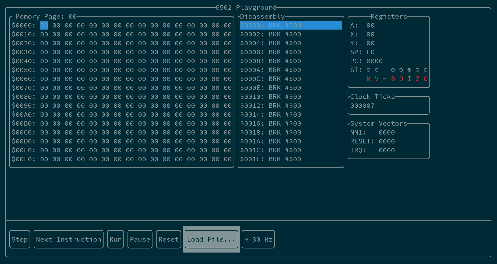

  </img>

# cli-6502-playground

A project intended for creating a 6502 emulator combined with editing capabilities for playing around with a basic 6502 system.  Uses the **terminal** as the output device.

The FTXUI terminal effects library is used for providing the UI and structure.

## Features

* A single-page window into the 64KB address space, complete with simple editing capabilities
* Disassembly window
* Register View window, also with the ability to edit the values
* Single-step one clock cycle
* Run at full speed
* Reset the processor (perform the 6502 reset sequence)
* Runs in a terminal only!

## Why do this?

Why else, but to learn!  I also was struck by the uniqueness of the FTXUI library, so I decided to try and see what I could do with it.

There seems to be a bit of a focus on the GUI nowadays, so I wanted something more minimal, and hopefully this will be a bit more portable
across platforms because of that.

## Build Instructions

Follow the FTXUI build instructions, using CMake.
Use qmake for **this** project.  I used QtCreator to generate and build the project, so for those who just want a GUI for development (the horror!  :D  ) I suggest using that.
## How do I operate this, now that I am running it?

You should notice that one of the pushbuttons along the bottom is highlighted.  This is the currently active one.  Pressing the Enter key will activate it (perform the displayed function).  You can use the arrow keys to move the selection around and change the currently focused item.  You can even move it to the other windows.

Pressing Esc will quit the program.

### The Different Windows

#### Memory Page

Displays a single page of memory.

The current program counter, if it is in the page, is displayed with the same color as the Disassembly view.

###### Keys

- PgUp/PgDn
    - Decrement/Increment the current page
- Arrow Keys
    - Normal Mode: Changes the currently selected byte in the page
    - Edit Mode: Left/Down to decrement the byte value.  Right/Up increments the value.
- Enter
    - Toggles edit mode for the selected byte

### Disassembly

Displays the disassembly around the current program counter.  The line of disassembly corresponding to the program counter is highlighted blue.

Currently non-editable.

### Registers

Displays all of the processor registers.

###### Keys

- UpArrow/DownArrow
    - Normal Mode: Move between the different registers
    - Edit Mode: Changes the value of the register
- Enter
    - Toggles edit mode for the selected register

#### Clock Ticks

Displays the number of clock cycles executed.  Pressing the Step button increases this by one.  Pressing the Next Instruction button increases it by the appropriate number of cycles for the instruction executed.

#### Reset Jump Address

Displays the value contained in the processor's hardware reset jump vector (located at $FFFC & $FFFD).  This is where the execution will start after a reset is performed (by pressing the Reset button).
